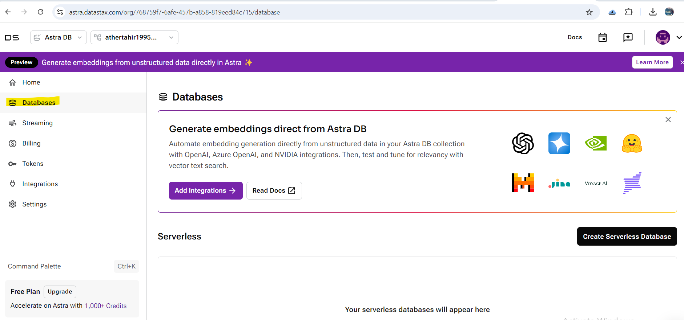

## Lab: Getting Started with Apache Cassandra / Astra DataStax

### Introduction

In today's fast-paced digital landscape, the need for robust, scalable,
and reliable databases is more critical than ever. Whether you're
developing a new application or scaling an existing one, choosing the
right database technology is a decision that can significantly impact
your project's success. Enter **DataStax Astra**, a fully managed,
serverless database-as-a-service (DBaaS) powered by Apache Cassandra®
--- one of the most resilient NoSQL databases in the industry.

### Why Choose Astra?

DataStax Astra makes it incredibly easy to harness the power of Apache
Cassandra without the overhead of managing the underlying
infrastructure. Here are some compelling reasons to consider Astra for
your next project:

- **10 GB Free, No Credit Card Needed**: You can get started with
    Astra in minutes, and with 10 GB of free storage, there's no risk
    and no upfront cost.
- **Built on Apache Cassandra**: Astra is built on the same
    open-source Apache Cassandra® that powers some of the world's most
    demanding applications, ensuring you get proven, enterprise-level
    performance.
- **Serverless and Scalable**: Astra eliminates the need to install,
    manage, and scale Cassandra instances. Its serverless architecture
    means it automatically scales up or down based on your workload,
    with no need for manual intervention.
- **Enterprise-Level Security and Reliability**: With
    enterprise-grade security and management features, Astra ensures
    your data is safe, available, and performant, no matter the
    scale.
- **Multi-Cloud Flexibility**: Deploy Astra on your preferred cloud
    provider, whether it's AWS, Google Cloud, or Microsoft Azure, and
    leverage a geographically distributed architecture.

### Getting Started with Astra DB in 10 Minutes

#### Step 1: Sign Up for Astra

To begin your journey with Astra, visit the [Astra registration
page](https://astra.datastax.com/register). You can sign up using your
email, Google, or GitHub account. No credit card is required, and you'll
receive 10 GB of free storage to start building and testing your
applications right away.

Signup URL: `https://astra.datastax.com/register`

#### Step 2: Explore the Database Options

Astra offers two types of serverless databases:

- **Serverless (Vector)**: Ideal for vector search applications, such
    as those used in Generative AI (GenAI), semantic search, and
    geospatial search. These databases can store vector embeddings
    alongside non-vector tabular data, making them perfect for
    applications requiring complex data retrieval, such as chatbots and
    sentiment analysis.
- **Serverless (Non-Vector)**: Designed for more generic
    applications, like content management, user authentication, and
    transactional applications. These databases provide the performance
    and reliability of Cassandra for a wide range of traditional
    workloads.

Select **Databases**:

#### Step 3: Understand the Terminology

Depending on your background, you might be familiar with various terms
for database components. Astra uses specific terms that may differ based
on the database type:

- **Namespace (Vector) / Keyspace (Non-Vector)**: A container for
    collections or tables within a database.
- **Collection (Vector) / Table (Non-Vector)**: A container for
    data.
- **Document (Vector) / Row (Non-Vector)**: A piece of data stored
    within a collection or table.
- **Field (Vector) / Column (Non-Vector)**: Attributes of the data,
    such as vector dimensions or IDs.

Understanding these terms will help you navigate Astra's interface and
API more effectively.

#### Step 4: Choose Your Cloud Provider

Astra supports multiple regions across Amazon Web Services, Google
Cloud, and Microsoft Azure. Depending on your location and needs, you
can deploy your database in a region that best suits your requirements.
Astra ensures high availability and low latency by allowing you to
choose from a wide range of regions, with different pricing options
depending on the region and provider.

### Conclusion

With DataStax Astra, getting started with Apache Cassandra has never
been easier. Whether you're developing cutting-edge AI applications or
managing traditional transactional workloads, Astra provides a powerful,
flexible, and easy-to-use platform to build your database solutions.
Best of all, you can explore all of this with a free tier that gives you
10 GB of storage at no cost --- perfect for getting up and running
quickly.

