## Lab: Creating a High-Performance Banking Database with Cassandra / DataStax Astra


### Introduction

In today's banking industry, data is the lifeblood of operations. From
managing transactions to ensuring compliance, banks rely on powerful
databases that can handle vast amounts of data with speed and
reliability. Traditional relational databases often struggle to keep up
with the scale and complexity of modern banking applications. This is
where **Apache Cassandra**, powered by **DataStax Astra**, comes into
play.

In this lab, you will go through the process of creating a
database in DataStax Astra using a compelling banking use case. We will
explore why Cassandra is the ideal choice for this scenario, and setup your database.

### The Banking Use Case: Real-Time Fraud Detection System

**Use Case Overview:**

Imagine a bank that handles millions of transactions daily. With
increasing cyber threats, the bank needs a real-time fraud detection
system that can analyze transactions as they occur, flag suspicious
activities, and take immediate action. The system must process high
volumes of data with minimal latency, ensuring that fraudulent
transactions are detected and prevented instantly.

**Why Apache Cassandra?**

1. **High Availability and Fault Tolerance:** In a banking
    environment, downtime is not an option. Cassandra's distributed
    architecture ensures that the system remains available even if
    multiple nodes fail. This is critical for a real-time fraud
    detection system that must be operational 24/7.
2. **Scalability:** Cassandra is designed to scale horizontally,
    meaning you can add more nodes to handle increased transaction
    volumes without impacting performance. As the bank grows, the system
    can seamlessly scale to accommodate more transactions.
3. **Low Latency:** With Cassandra's distributed nature, data can be
    replicated across multiple regions, ensuring that transactions are
    processed close to the user, reducing latency. This is vital for
    detecting and responding to fraudulent activities in
    real-time.
4. **Flexible Data Model:** Cassandra's support for a flexible schema
    allows the system to adapt to new fraud detection algorithms and
    evolving data structures without significant redesigns.

### Step-by-Step: Creating a Database in DataStax Astra for Our Use Case

#### Step 1: Sign Up for DataStax Astra

Start by signing up for a free account on [DataStax
Astra](https://astra.datastax.com/register). You'll get 10 GB of free
storage, which is more than enough to begin setting up your fraud
detection system.

#### Step 2: Create a Serverless (Non-Vector) Database

For this use case, we'll create a **Serverless (Non-Vector) Database**
since our focus is on transactional data rather than vector-based data.

1. **Navigate to Databases:** Once logged into the Astra Portal,
    select **Databases** from the main navigation.
2. **Create Database:**

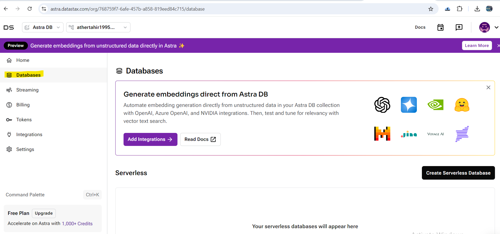

- Click on **Create Serverless Database**.
- In the **Create Database** dialog, select the **Serverless
    (Non-Vector)** deployment type.
- **Configuration:**
- **Database Name:** Enter a meaningful name like `FraudDetectionDB`.
- **Keyspace Name:** Name the keyspace `frauddetectionks`. The keyspace will contain all the tables related to our
    fraud detection system.
- **Provider and Region:** Choose a cloud provider and region that
    best suits your needs. For example, if your bank operates primarily
    in North America, you might choose `us-east1` in Google Cloud. Choose any available provider and region (that
    is not locked).

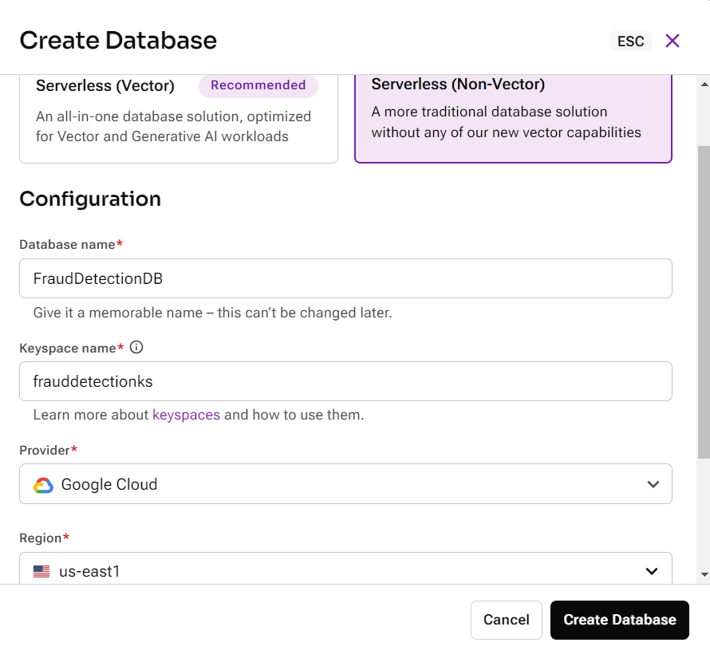

1. **Click Create Database:** Your database will start in Pending
    status and move to Initializing. Once the database reaches Active
    status, it's ready to use.

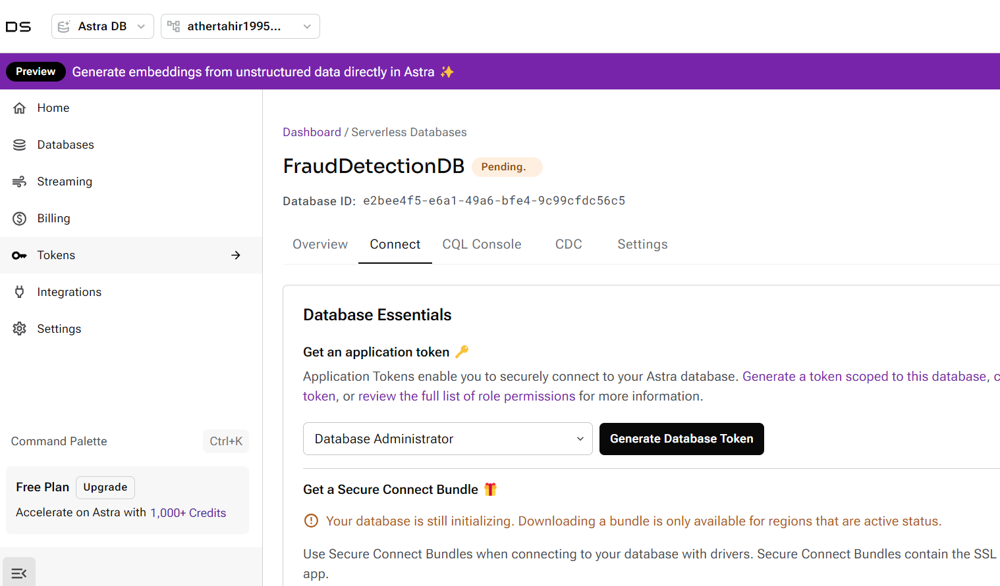

Click **CQL Console** and wait for sometime while database is in `Pending` state.

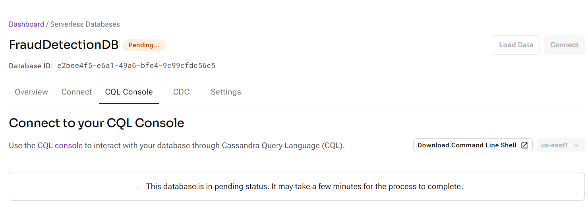


#### Step 3: Designing the Data Model

For our fraud detection system, we'll need several tables to store
transactions, flagged activities, user profiles, and more. Here's a
simplified version:

- **Transactions Table:** Stores all transaction data.
- **Table Name:** `transactions`
- **Primary Key:** `transaction_id`
- **Columns:** `account_id`,
    `transaction_amount`, `transaction_time`, `merchant_id`,
    `location`, etc.
- **Flagged Activities Table:** Stores suspicious activities flagged
    by the system.
- **Table Name:** `flagged_activities`
- **Primary Key:** `flag_id`
- **Columns:** `transaction_id`,
    `account_id`, `flag_reason`, `flag_time`, `resolved`, etc.
- **User Profiles Table:** Stores user-related information for
    context during fraud detection.
- **Table Name:** `user_profiles`
- **Primary Key:** `account_id`
- **Columns:** `name`, `address`, `phone_number`, `email`, `risk_score`, etc.

#### Step 4: Creating Tables and Loading Data

1. **Access the CQL Console:**

- In the Astra Portal, navigate to your newly created database and
    click on **CQL Console** to start defining your tables.

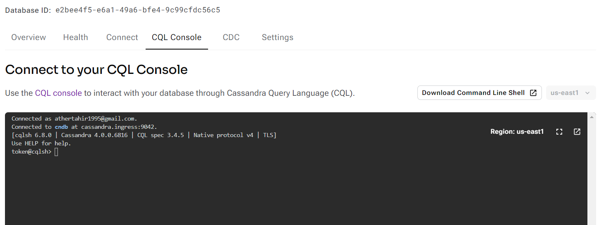

1. **Create the Transactions Table:**

```
CREATE TABLE frauddetectionks.transactions (
    transaction_id TEXT PRIMARY KEY,
    account_id TEXT,
    transaction_amount DECIMAL,
    transaction_time TEXT,
    merchant_id TEXT,
    location TEXT,
    fraud_status TEXT
);
```

1. **Create the Flagged Activities Table:**

```
CREATE TABLE frauddetectionks.flagged_activities (
    flag_id TEXT PRIMARY KEY,
    transaction_id TEXT,
    account_id TEXT,
    flag_reason TEXT,
    flag_time TIMESTAMP,
    resolved BOOLEAN
);
```


1. **Create the User Profiles Table:**

```
CREATE TABLE frauddetectionks.user_profiles (
    account_id TEXT PRIMARY KEY,
    name TEXT,
    address TEXT,
    phone_number TEXT,
    email TEXT,
    risk_score DECIMAL
);
```

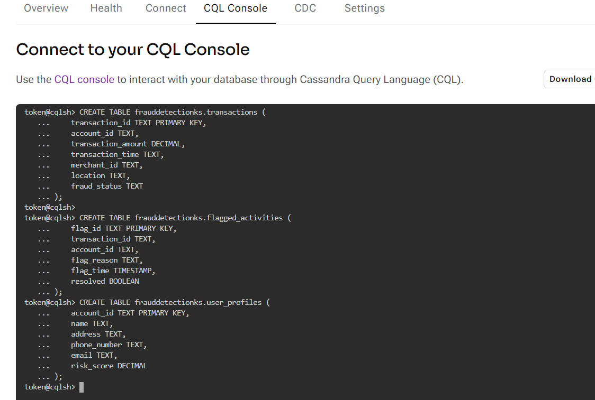

1. **Loading Data:** You can load data into these tables using the CQL
    `INSERT` command or by uploading CSV files
    through the Astra Portal's data tools.

#### Step 5: Connecting to Your Database

Once your tables are created and data is loaded, you can connect your
application to the Astra database using the provided connection
information in the Astra Portal. Astra supports multiple connection
methods, including CQL, REST, and GraphQL APIs, making it easy to
integrate into your existing systems.

### Conclusion

By following this guide, you've set up a powerful, scalable, and
resilient database tailored to a critical banking use case: real-time
fraud detection. With DataStax Astra and Apache Cassandra, you've laid
the groundwork for a system that can handle massive amounts of data with
the speed and reliability necessary for modern banking applications.

Whether you're building a fraud detection system or any other
high-performance application, Cassandra and Astra offer the flexibility,
scalability, and power needed to succeed.

### Part 2: Loading Data into Your DataStax Astra Banking Database

### Introduction

In previous lab, we walked through the process of
setting up a Serverless (Non-Vector) database in DataStax Astra,
tailored to a real-time fraud detection system for a banking
application. Now that your database is up and running, it's time to load
it with data. In this part, we'll guide you through the process of
preparing your data, creating the necessary resources, and finally
loading the data into your database.

### Step 1: Preparing Your Data

For this example, we'll use sample data that simulates banking
transactions. If you have your own data, you can use that instead.
Otherwise, follow along with the sample data provided below.

#### Sample CSV Data

We'll create a CSV file that contains transaction data. Here's what the
contents of the `transactions.csv` file will
look like:

```
transaction_id,account_id,transaction_amount,transaction_time,merchant_id,location,fraud_status
1e75a5b1-ec5a-4c32-a1b2-b6a67940f5a4,acc_001,250.75,2024-08-27 14:35:20,merch_001,"New York, NY",false
2d85b6b2-ec6a-4d42-a2c3-c7b78950g6b5,acc_002,1450.00,2024-08-27 15:00:00,merch_002,"Los Angeles, CA",false
3f95c7c3-fd7a-5e52-b3d4-d8c79961h7c6,acc_003,560.25,2024-08-27 15:15:30,merch_003,"Chicago, IL",true
4g16d8d4-ge8b-6f63-c4e5-e9d8aa72i8d7,acc_004,80.00,2024-08-27 15:45:10,merch_004,"Miami, FL",false
5h27e9e5-hf9c-7g74-d5f6-faebbb83j9e8,acc_005,320.50,2024-08-27 16:10:45,merch_005,"San Francisco, CA",true
6i38f0f6-ig0d-8h85-e6g7-gbecbc94k0f9,acc_006,270.00,2024-08-28 10:00:30,merch_006,"Austin, TX",false
7j49g1g7-jh1e-9i96-f7h8-hcfcdd05l1g0,acc_007,130.75,2024-08-28 11:15:50,merch_007,"Seattle, WA",false
8k50h2h8-kj2f-0j07-g8i9-idgdee16m2h1,acc_008,990.40,2024-08-28 12:30:10,merch_008,"Boston, MA",true
9l61i3i9-lk3g-1k18-h9j0-jehfee27n3i2,acc_009,245.00,2024-08-28 13:45:25,merch_009,"Houston, TX",false
0m72j4j0-ml4h-2l29-i0k1-kfifff38o4j3,acc_010,675.25,2024-08-28 15:00:45,merch_010,"Atlanta, GA",false
1n83k5k1-nm5i-3m30-j1l2-lgjggg49p5k4,acc_011,1340.00,2024-08-29 09:15:10,merch_011,"Denver, CO",true
2o94l6l2-on6j-4n41-k2m3-mhkhhh50q6l5,acc_012,410.90,2024-08-29 10:30:20,merch_012,"Orlando, FL",false
3p05m7m3-po7k-5o52-l3n4-niilli61r7m6,acc_013,230.65,2024-08-29 11:45:35,merch_013,"Las Vegas, NV",false
4q16n8n4-qp8l-6p63-m4o5-ojjmmm72s8n7,acc_014,990.00,2024-08-29 13:00:55,merch_014,"San Diego, CA",true
5r27o9o5-rq9m-7q74-n5p6-pkkonm83t9o8,acc_015,580.50,2024-08-29 14:15:15,merch_015,"Portland, OR",false
6s38p0p6-sr0n-8r85-o6q7-qllooo94u0p9,acc_016,150.75,2024-08-30 09:30:30,merch_016,"Phoenix, AZ",false
7t49q1q7-ts1o-9s96-p7r8-rmmppp05v1q0,acc_017,235.90,2024-08-30 10:45:45,merch_017,"Salt Lake City, UT",true
8u50r2r8-ut2p-0t07-q8s9-snnqqq16w2r1,acc_018,890.25,2024-08-30 12:00:10,merch_018,"Charlotte, NC",false
9v61s3s9-vu3q-1u18-r9t0-toorrs27x3s2,acc_019,210.80,2024-08-30 13:15:25,merch_019,"Dallas, TX",false
0w72t4t0-wv4r-2v29-s0u1-upptts38y4t3,acc_020,1050.00,2024-08-30 14:30:40,merch_020,"Nashville, TN",true
1x83u5u1-wx5s-3w30-t1v2-vqqttt49z5u4,acc_021,410.55,2024-08-31 09:45:55,merch_021,"Memphis, TN",false
2y94v6v2-xy6t-4x41-u2w3-wrruuu50a6v5,acc_022,135.75,2024-08-31 11:00:10,merch_022,"Baltimore, MD",false
3z05w7w3-yz7u-5y52-v3x4-xsstvv61b7w6,acc_023,750.00,2024-08-31 12:15:25,merch_023,"Indianapolis, IN",true
4a16x8x4-z01v-6z63-w4y5-yuutvv72c8x7,acc_024,495.30,2024-08-31 13:30:40,merch_024,"Cleveland, OH",false
5b27y9y5-a12w-7a74-x5z6-avvvww83d9y8,acc_025,330.00,2024-08-31 14:45:55,merch_025,"Kansas City, MO",false
6c38z0z6-b23x-8b85-y6a7-bwwwxx94e0z9,acc_026,890.15,2024-09-01 09:00:20,merch_026,"Columbus, OH",true
7d49a1a7-c34y-9c96-z7b8-cxxxzz05f1a0,acc_027,580.75,2024-09-01 10:15:35,merch_027,"Milwaukee, WI",false
8e50b2b8-d45z-0d07-01c9-dyyy0116g2b1,acc_028,270.00,2024-09-01 11:30:50,merch_028,"Louisville, KY",true
9f61c3c9-e56a-1e18-12d0-ezzz1227h3c2,acc_029,420.45,2024-09-01 12:45:10,merch_029,"Oklahoma City, OK",false
0g72d4d0-f67b-2f29-23e1-faaa2338i4d3,acc_030,670.00,2024-09-01 14:00:25,merch_030,"Minneapolis, MN",false
1h83e5e1-g78c-3g30-34f2-gbbb3449j5e4,acc_031,1300.50,2024-09-02 09:15:40,merch_031,"St. Louis, MO",true
2i94f6f2-h89d-4h41-45g3-hccc4550k6f5,acc_032,490.80,2024-09-02 10:30:55,merch_032,"Cincinnati, OH",false
3j05g7g3-i90e-5i52-56h4-iddc5661l7g6,acc_033,230.65,2024-09-02 11:45:10,merch_033,"New Orleans, LA",true
4k16h8h4-j01f-6j63-67i5-jeee6772m8h7,acc_034,760.90,2024-09-02 13:00:25,merch_034,"Pittsburgh, PA",false
5l27i9i5-k12g-7k74-78j6-kfff7883n9i8,acc_035,150.75,2024-09-02 14:15:40,merch_035,"Raleigh, NC",false
6m38j0j6-l23h-8l85-89k7-lggg8994o0j9,acc_036,235.90,2024-09-03 09:30:55,merch_036,"Richmond, VA",true
7n49k1k7-m34i-9m96-90l8-mhhh9005p1k0,acc_037,990.00,2024-09-03 10:45:10,merch_037,"Tampa, FL",false
8o50l2l8-n45j-0n07-01m9-niii0116q2l1,acc_038,580.75,2024-09-03 12:00:25,merch_038,"Jacksonville, FL",true
9p61m3m9-o56k-1o18-12n0-ojjj1227r3m2,acc_039,270.00,2024-09-03 13:15:40,merch_039,"Buffalo, NY",false
0q72n4n0-p67l-2p29-23o1-pkkk2338s4n3,acc_040,420.45,2024-09-03 14:30:55,merch_040,"Fort Worth, TX",false
1r83o5o1-q78m-3q30-34p2-qlll3449t5o4,acc_041,670.00,2024-09-04 09:45:10,merch_041,"El Paso, TX",true
2s94p6p2-r89n-4r41-45q3-rmmm4550u6p5,acc_042,1300.50,2024-09-04 11:00:25,merch_042,"Detroit, MI",false
3t05q7q3-s90o-5s52-56r4-snnn5661v7q6,acc_043,490.80,2024-09-04 12:15:40,merch_043,"Charlotte, NC",false
4u16r8r4-t01p-6t63-67s5-tooo6772w8r7,acc_044,230.65,2024-09-04 13:30:55,merch_044,"San Antonio, TX",true
5v27s9s5-u12q-7u74-78t6-uppp7883x9s8,acc_045,760.90,2024-09-04 14:45:10,merch_045,"Austin, TX",false
6w38t0t6-v23r-8v85-89u7-vqqq8994y0t9,acc_046,150.75,2024-09-05 09:00:25,merch_046,"Tucson, AZ",true
7x49u1u7-w34s-9w96-90v8-wrrr9005z1u0,acc_047,235.90,2024-09-05 10:15:40,merch_047,"Albuquerque, NM",false
8y50v2v8-x45t-0x07-01w9-xsst0116a2v1,acc_048,890.25,2024-09-05 11:30:55,merch_048,"Las Vegas, NV",false
9z61w3w9-y56u-1y18-12x0-yuuu1227b3w2,acc_049,210.80,2024-09-05 12:45:10,merch_049,"Mesa, AZ",true
0a72x4x0-z67v-2z29-23y1-zvvv2338c4x3,acc_050,1050.00,2024-09-05 14:00:25,merch_050,"Colorado Springs, CO",false
1b83y5y1-a78w-3a30-34z2-avww3449d5y4,acc_051,410.55,2024-09-06 09:15:40,merch_051,"Omaha, NE",true
2c94z6z2-b89x-4b41-45a3-bxxx4550e6z5,acc_052,135.75,2024-09-06 10:30:55,merch_052,"Tulsa, OK",false
3d05a7a3-c90y-5c52-56b4-cyyy5661f7a6,acc_053,750.00,2024-09-06 11:45:10,merch_053,"Wichita, KS",false
4e16b8b4-d01z-6d63-67c5-dzzz6772g8b7,acc_054,495.30,2024-09-06 13:00:25,merch_054,"Arlington, TX",true
5f27c9c5-e12a-7e74-78d6-eaaa7883h9c8,acc_055,330.00,2024-09-06 14:15:40,merch_055,"New Orleans, LA",false
6g38d0d6-f23b-8f85-89e7-fbbb8994i0d9,acc_056,890.15,2024-09-07 09:30:55,merch_056,"Bakersfield, CA",true
7h49e1e7-g34c-9g96-90f8-gccc9005j1e0,acc_057,580.75,2024-09-07 10:45:10,merch_057,"Aurora, CO",false
8i50f2f8-h45d-0h07-01g9-hddd0116k2f1,acc_058,270.00,2024-09-07 12:00:25,merch_058,"Anaheim, CA",false
9j61g3g9-i56e-1i18-12h0-ieee1227l3g2,acc_059,420.45,2024-09-07 13:15:40,merch_059,"Santa Ana, CA",true
0k72h4h0-j67f-2j29-23i1-jfff2338m4h3,acc_060,670.00,2024-09-07 14:30:55,merch_060,"Riverside, CA",false
1l83i5i1-k78g-3k30-34j2-kggg3449n5i4,acc_061,1300.50,2024-09-08 09:00:25,merch_061,"Stockton, CA",false
2m94j6j2-l89h-4l41-45k3-lhhh4550o6j5,acc_062,490.80,2024-09-08 10:15:40,merch_062,"Henderson, NV",true
3n05k7k3-m90i-5m52-56l4-miii5661p7k6,acc_063,230.65,2024-09-08 11:30:55,merch_063,"Chula Vista, CA",false
4o16l8l4-n01j-6n63-67m5-njjj6772q8l7,acc_064,760.90,2024-09-08 12:45:10,merch_064,"Irvine, CA",false
5p27m9m5-o12k-7o74-78n6-okkk7883r9m8,acc_065,150.75,2024-09-08 14:00:25,merch_065,"Fremont, CA",true
6q38n0n6-p23l-8p85-89o7-plll8994s0n9,acc_066,235.90,2024-09-09 09:15:40,merch_066,"San Bernardino, CA",false
7r49o1o7-q34m-9q96-90p8-qmmm9005t1o0,acc_067,990.00,2024-09-09 10:30:55,merch_067,"Modesto, CA",true
8s50p2p8-r45n-0r07-01q9-rrrr0116u2p1,acc_068,580.75,2024-09-09 11:45:10,merch_068,"Fontana, CA",false
9t61q3q9-s56o-1s18-12r0-ssss1227v3q2,acc_069,270.00,2024-09-09 13:00:25,merch_069,"Moreno Valley, CA",false
0u72r4r0-t67p-2t29-23s1-tttt2338w4r3,acc_070,420.45,2024-09-09 14:15:40,merch_070,"Glendale, CA",true
1v83s5s1-u78q-3u30-34t2-uuuu3449x5s4,acc_071,670.00,2024-09-10 09:30:55,merch_071,"Oxnard, CA",false
2w94t6t2-v89r-4v41-45u3-vvvv4550y6t5,acc_072,1300.50,2024-09-10 10:45:10,merch_072,"Huntington Beach, CA",true
3x05u7u3-w90s-5w52-56v4-wwwx5661z7u6,acc_073,490.80,2024-09-10 12:00:25,merch_073,"Santa Clarita, CA",false
4y16v8v4-x01t-6x63-67w5-xxxy6772a8v7,acc_074,230.65,2024-09-10 13:15:40,merch_074,"Garden Grove, CA",true
5z27w9w5-y12u-7y74-78x6-yyyw7883b9w8,acc_075,760.90,2024-09-10 14:30:55,merch_075,"Santa Rosa, CA",false
```

To create this CSV file:

1. Open a text editor or spreadsheet application (such as Excel or
    Google Sheets).
2. Enter the above data into the appropriate cells/fields.
3. Save the file as `transactions.csv`.

**Note:** File is also available in GitHub repo: `https://github.com/fenago/cassandra`

### Step 2: Load Data Using the Astra Portal

With your data prepared, we can now load it into the `transactions` table you created in Part 1.

#### Load the CSV Data into Astra

1. **Log in to the Astra Portal:**

- Navigate to the [Astra Portal](https://astra.datastax.com/) and log in with your credentials.

1. **Navigate to Your Database:**

- In the Astra Portal, go to **Databases** and select your
    `FraudDetectionDB` database.

1. **Access the Data Loader:**

- Click on **Load Data** to access the data loading tools.

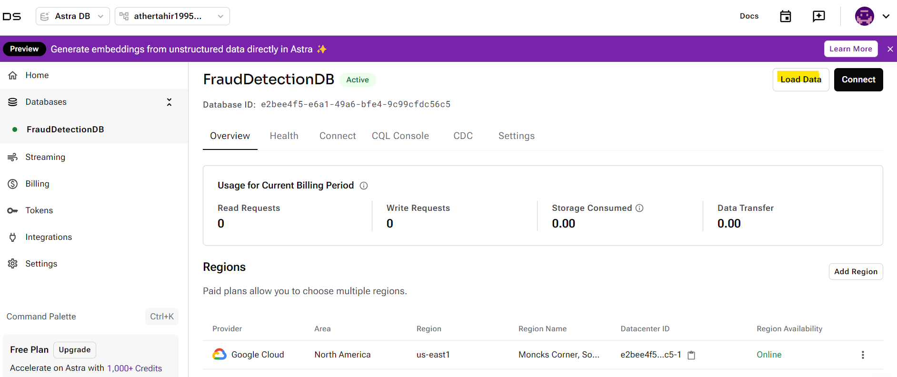

1. **Upload the CSV File:**

- In the Data Loader, click **Select File** and choose the
    `transactions.csv` file you created
    earlier.

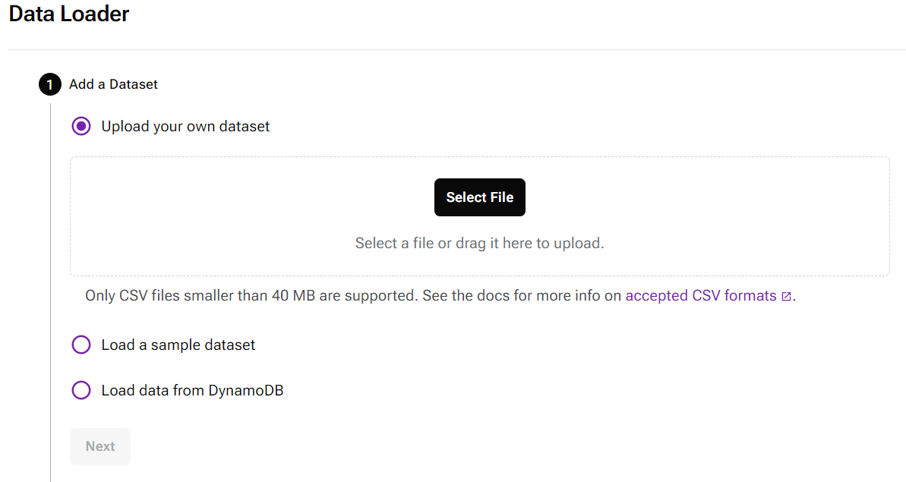

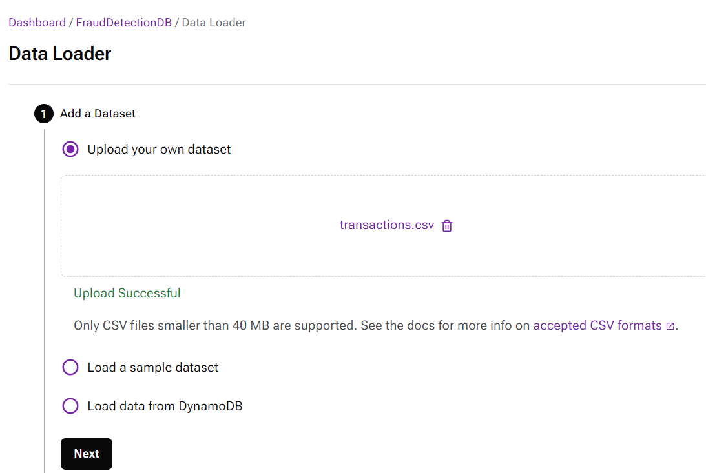

- Wait for the file to upload. Once uploaded, you'll see a preview of
    the first ten rows in the **Data Preview** section.

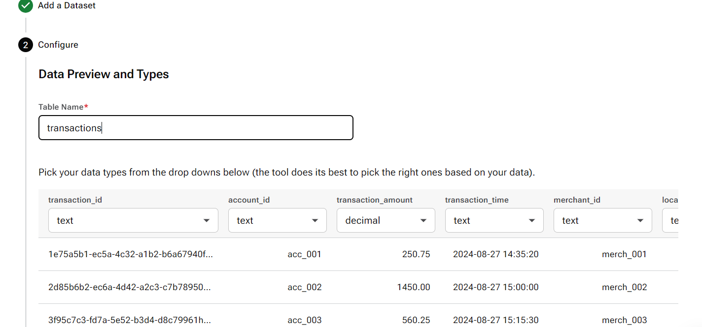

1. **Review Data Types:**

- Review the data types for each column. The Data Loader will
    automatically detect the types. Ensure that the types match the schema defined in the `transactions` table:

- `transaction_id`: TEXT
- `account_id`: TEXT
- `transaction_amount`: DECIMAL
- `transaction_time`: TEXT
- `merchant_id`: TEXT
- `location`: TEXT
- `fraud_status`: TEXT


1. **Partition Keys and Clustering Columns:**

- From the **Partition keys** drop-down, select `transaction_id` as the partition key.
- You can skip clustering columns for this example, as the
    `transaction_id` serves as a unique
    identifier.

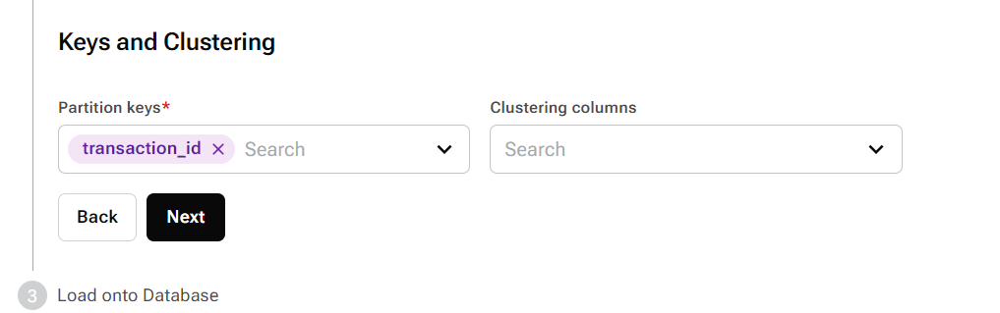


1. **Load the Data:**

- Click **Next** and then **Finish** to start the data import process.

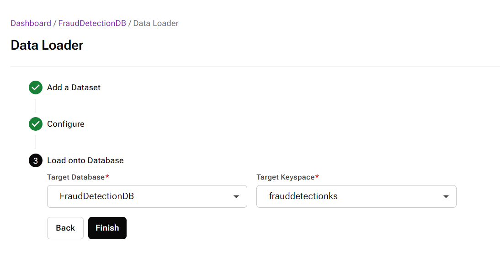

- You'll receive an email notification once the data import is complete.

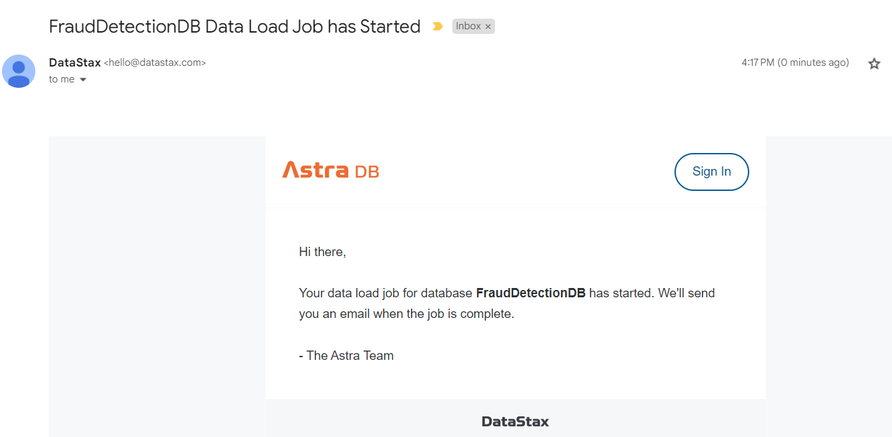

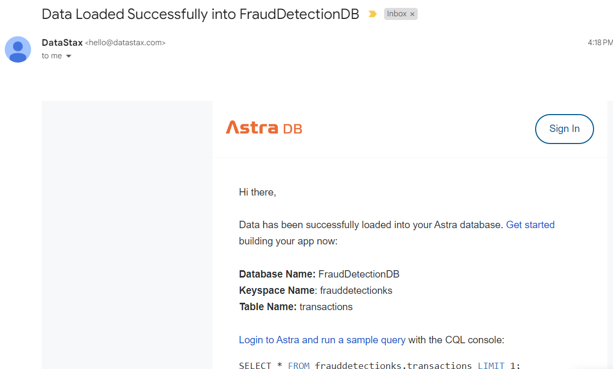

**Note:** It will take time for data import to complete. You can start the next steps after data import is completed.

### Step 3: Verify the Loaded Data

After loading the data, it's essential to verify that the data has been
loaded correctly.

#### Use the CQL Console to Verify

1. **Open the CQL Console:**

- In the Astra Portal, navigate to your `FraudDetectionDB` database.
- Click on **CQL Console**.

1. **Select the Keyspace:**

- At the `token@cqlsh>` prompt, use the
    following command to select your keyspace:

```
USE frauddetectionks;
```

1. **Run a Query to Verify Data:**

- Execute the following query to retrieve the first few rows from the
    `transactions` table:

```
SELECT * FROM transactions LIMIT 5;
```


1. **Review the Results:**

- The console should display the rows from your CSV file. Verify that
    all columns and data types match your expectations.

### Step 4: Load a Sample Dataset (Optional)

If you prefer to test with a pre-built dataset, Astra provides sample
datasets that you can load to explore features before using your own
data.

1. **Load a Sample Dataset:**

- In the Astra Portal, go to **Databases** and select your database.
- Click on **Data Loader**.
- Choose an empty namespace, or create one if needed.
- Click **Load a sample dataset** to load a sample dataset.
- You can now interact with this sample data.

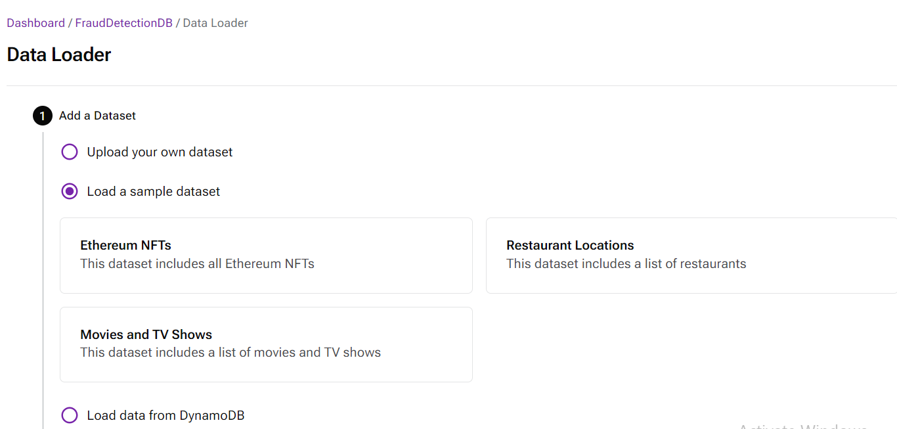


### Conclusion

Congratulations! You've successfully loaded your transaction data into
your DataStax Astra database, laying the foundation for a powerful,
real-time fraud detection system. By following these steps, you've moved
from database creation to data ingestion, ensuring that your banking
application is ready to handle and analyze transactional data at scale.


### Part 3: Connecting to Your DataStax Astra Banking Database Using Google Colab

### Introduction

In previous lab, we created a Serverless (Non-Vector)
database in DataStax Astra for a real-time fraud detection system in a
banking use case. Then, we loaded sample transaction data into
the database. Now, in this final part, we'll guide you through
connecting to your Astra database using Google Colab and Python. This
connection will allow you to interact with your database
programmatically, making it easier to integrate with applications or
perform data analysis.

### Prerequisites

Before we dive into the code, ensure you have the following:

1. **Astra Account**: You should already have an active Astra account
    from Part 1.
2. **Astra DB Serverless Database**: Your `FraudDetectionDB` database should be set up and loaded with
    data.
3. **Application Token**: You need an application token with the
    Database Administrator role.
4. **Google Colab Account**: A Google account to use Google
    Colab.

### Step 1: Generate an Application Token

To connect to your Astra database, you'll need an application token.
Here's how to generate one:

1. **Log in to the Astra Portal**: Visit [Astra
    Portal](https://astra.datastax.com/) and log in.
2. **Navigate to Tokens**: In the left navigation, click on
    **Tokens**.
3. **Generate Token**:

- Select **Database Administrator** as the role.
- Click **Generate Token**.

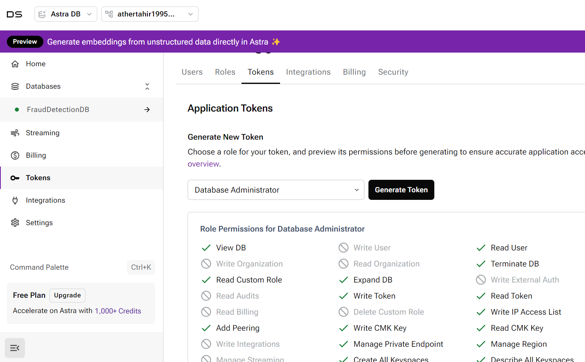

- Download the json file. You will need these for authentication.

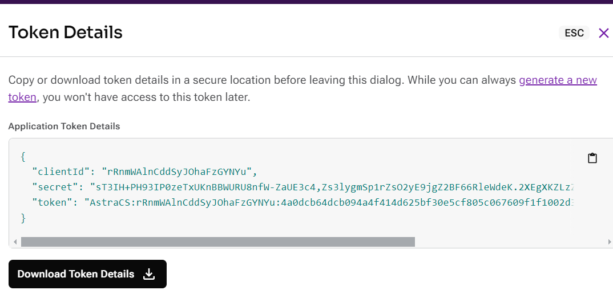

### Step 2: Set Up Google Colab

Now that you have your token, let's set up Google Colab to interact with
your Astra database.

1. **Open Google Colab**: Go to Google Colab and start a new
    notebook: `https://colab.research.google.com/`
2. **Install Cassandra Driver**: Install it using the following command:

```
!pip install cassandra-driver
```

1. **Import Required Libraries**: In your Colab notebook, import the necessary libraries:

```
from cassandra.cluster import Cluster
from cassandra.auth import PlainTextAuthProvider
import json
```


### Step 3: Setup

You'll need to set up connect bundle and token json.

1. **Secure Connect Bundle**: If you haven't downloaded the Secure
    Connect Bundle (SCB) yet, follow these steps:

- In the Astra Portal, go to **Databases**.
- Select your `FraudDetectionDB`.
- Click **Connect** and download the Secure Connect Bundle for your region.

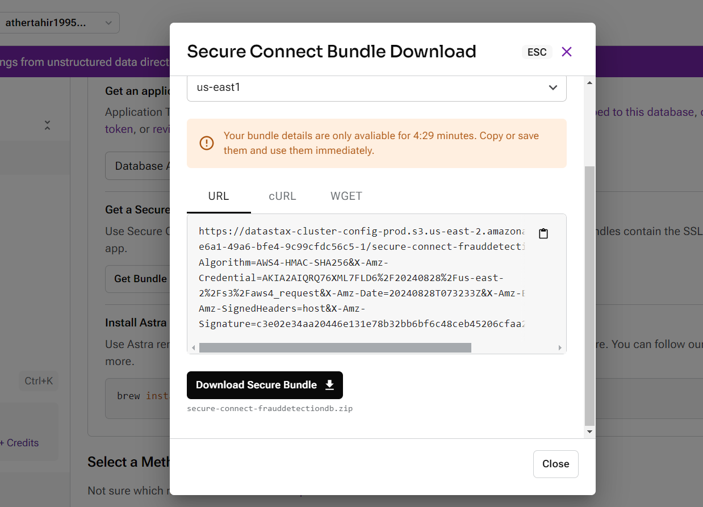

1. **Upload the SCB to Google Colab**:

- In Google Colab, click the **Files** tab on the left side.
- Upload your SCB file (it will have a `.zip`
    extension).

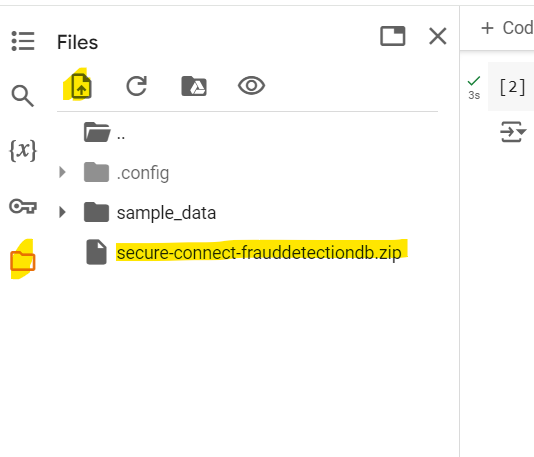


1. **Upload the SCB to Google Colab**:

- In Google Colab, click the **Files** tab on the left side.
- Upload your token file (it will have a `.json` extension).


1. **Set Secret Paths**: Set bundle and token in your Colab notebook:

```
# This secure connect bundle is autogenerated when you download your SCB, 
# if yours is different update the file name below
cloud_config= {
  'secure_connect_bundle': 'UPDATE_FILE_NAME.zip'
}

# This token JSON file is autogenerated when you download your token, 
# if yours is different update the file name below
with open("UPDATE_FILE_NAME.json") as f:
    secrets = json.load(f)

CLIENT_ID = secrets["clientId"]
CLIENT_SECRET = secrets["secret"]
```

### Step 4: Connect to Your Cluster

```
auth_provider = PlainTextAuthProvider(CLIENT_ID, CLIENT_SECRET)
cluster = Cluster(cloud=cloud_config, auth_provider=auth_provider)
session = cluster.connect()
```


1. **Verify Connection**: To ensure everything is working:

```
row = session.execute("select release_version from system.local").one()
if row:
  print(row[0])
else:
  print("An error occurred.")
```

### Step 5: Perform Operations on the Database

With the connection established, you can now perform various operations.
For instance, let's query the `transactions`
table to retrieve the first few records.

1. **Query the Transactions Table**:

```
transactions = session.execute("SELECT * FROM frauddetectionks.transactions LIMIT 5")
for transaction in transactions:
    print(transaction)
```

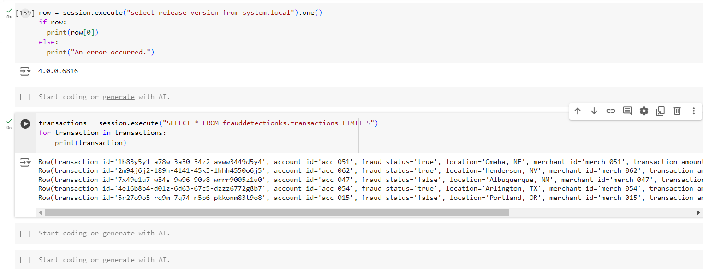

This will print out the first five records from the `transactions` table, allowing you to inspect the data you loaded in Part 2.

### Step 6: Save and Share Your Colab Notebook

Once you've successfully connected to your database and run some
queries, you might want to save and share your work.

1. **Save the Notebook**: Click on **File** \> **Save a copy in Drive** to save your notebook in Google Drive.
2. **Share the Notebook**: Click on **Share** to generate a shareable
    link, making it easy to collaborate with others.

### Conclusion

Congratulations! You've successfully connected to your DataStax Astra
database using Google Colab and Python. This setup allows you to
leverage the power of Astra and Python together, enabling you to build,
test, and deploy applications efficiently. Whether you're analyzing
data, building machine learning models, or integrating with other
systems, Google Colab provide a robust environment to
achieve your goals.

In the next steps, you might want to explore more advanced queries,
integrate with other tools, or start developing a full-fledged
application. The possibilities are endless with DataStax Astra and
Python!

### Addendum: Viewing and Managing Metrics in DataStax Astra

To ensure your database is performing optimally and to gain insights
into your data operations, it's crucial to monitor and analyze various
metrics within DataStax Astra. This addendum will guide you through the
process of viewing key metrics related to your namespaces, keyspaces,
collections, and tables in Astra. These metrics will help you better
understand the health, performance, and usage patterns of your database.

#### Step 1: Accessing Database Metrics in Astra Portal

1. **Log in to Astra Portal:**

- Visit [Astra Portal](https://astra.datastax.com/) and log in with your credentials.

1. **Navigate to Your Database:**

- From the **Databases** section, select the database you want to
    monitor (e.g., `FraudDetectionDB`).

1. **View Metrics Overview:**

- On the **Overview** tab, you will see a summary of key metrics,
    including:
- **CPU Usage:** Tracks the processing power being used by your
    database.
- **Disk Usage:** Shows the total amount of storage used and
    available.
- **Throughput:** Displays the number of operations per second, such
    as reads and writes.
- **Latency:** Measures the response time for read and write
    operations.

#### Step 2: Monitoring Keyspace and Namespace Metrics

1. **Keyspace Metrics (Non-Vector Databases):**

- Go to the **Keyspaces** section in your Serverless (Non-Vector)
    database.
- Select the keyspace you wish to monitor.
- Key metrics include:
- **Total Tables:** The number of tables within the keyspace.
- **Table Size:** The total size of all tables within the
    keyspace.
- **Replication Factor:** Indicates the number of copies of data
    maintained across nodes.
- Drill down into each table to view more specific metrics, such as
    **read/write requests**, **SSTable counts**, and **compaction
    metrics**.

1. **Namespace Metrics (Vector Databases):**

- Navigate to the **Namespaces** section in your Serverless (Vector)
    database.
- Select the namespace you wish to monitor.
- Important metrics include:
- **Total Collections:** The number of collections within the
    namespace.
- **Collection Size:** The total storage used by collections.
- **Embedding Generation Success Rate:** If using vector collections,
    monitor the success rate of embedding generation.
- **Query Latency:** Average time taken to retrieve data from
    collections.

#### Step 3: Analyzing Collection and Table Metrics

1. **Collection Metrics (Vector Databases):**

- Select the **Data Explorer** tab for your Vector database.
- Choose a namespace and a collection to view detailed
    metrics.
- Key metrics to observe:
- **Document Count:** Total number of documents in the
    collection.
- **Vector Dimensions:** Number of dimensions in the vectors stored
    within the collection.
- **Query Throughput:** Number of queries processed per
    second.
- **Index Performance:** Efficiency and speed of Storage Attached
    Indexing (SAI) within the collection.

1. **Table Metrics (Non-Vector Databases):**

- Use the **CQL Console** to access table-specific metrics in your
    Non-Vector database.
- Run the following CQL command to retrieve performance metrics for a
    specific table:

```
nodetool cfstats frauddetectionks.transactions
```

- Metrics to look for:
- **Live Disk Space Used:** Amount of disk space currently used by
    the table.
- **Read/Write Latency:** Average time taken for read/write
    operations.
- **SSTable Count:** Number of SSTables (Sorted String Tables)
    associated with the table.
- **Compaction Operations:** Number of ongoing or completed
    compaction operations.

#### Step 4: Setting Up Alerts and Notifications

1. **Set Up Threshold Alerts:**

- In the **Metrics** tab, set up threshold alerts to be notified when
    certain metrics exceed predefined values.
- Examples:
- **CPU Usage Threshold:** Set an alert if CPU usage exceeds
    80%.
- **Disk Space Threshold:** Trigger an alert if disk usage exceeds
    75%.

1. **Enable Email Notifications:**

- Ensure that email notifications are enabled for critical alerts, so
    you are immediately informed of any issues that need
    attention.

#### Step 5: Regular Monitoring and Maintenance

1. **Regular Review:**

- Regularly review the metrics dashboard to keep an eye on the health
    of your database.
- Pay special attention to any spikes in latency or throughput, as
    these could indicate potential performance bottlenecks.

1. **Perform Maintenance:**

- Based on the metrics, perform necessary maintenance tasks such as
    compaction, repair operations, or scaling of resources.

### Conclusion

By closely monitoring the metrics provided by DataStax Astra, you can
ensure that your database operates efficiently and effectively. This
proactive approach allows you to detect and resolve potential issues
before they impact your application, ensuring a smooth and reliable user
experience. Keep in mind that regular review and maintenance are
essential for maintaining optimal database performance.
